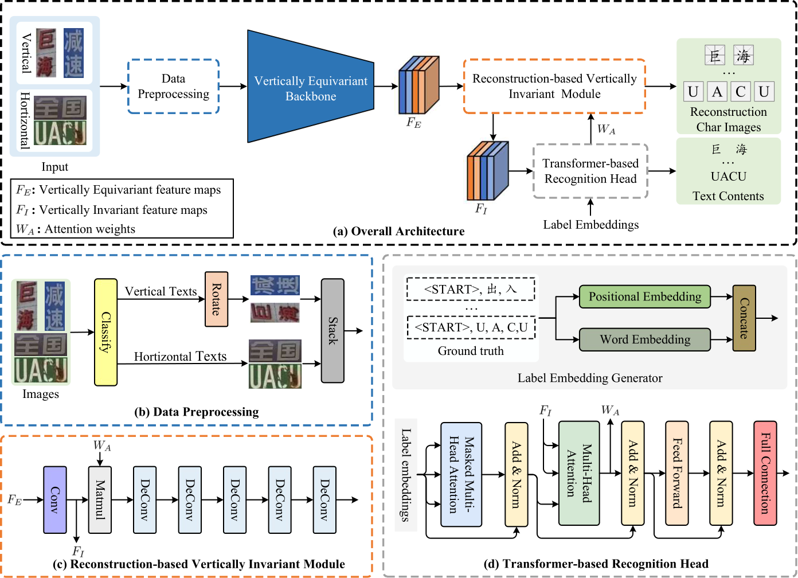

# VINet: Vertically Invariant Network for Vertical and Horizontal Scene Text Recognition
This repo releases the code and dataset of "VINet: Vertically Invariant Network for Vertical and Horizontal Scene Text Recognition". 
For more details, please refer to our paper.




## Environments
- Linux (tested on Ubuntu 18.04LTS)
- NVIDIA GPU (Tested on 1080Ti, 3090 and 4060)
- Cuda (Tested on 10.1, 11.0, and 11.1)
- Python (Tested on 3.7.13, and 3.8.6)
- Pytorch (Tested on 1.7.1, and 1.9.0)

## Installation
First, clone the repository locally:

```shell
git clone https://github.com/ChengliZhu777/VINet.git
```

Then, install Python3.8.6, Pytorch 1.9.0, and Torchvision 0.10.0, and other requirements:
```shell
conda create --name VINet python==3.8.6
conda activate VINet
pip install torch==1.9.0+cu111 torchvision==0.10.0+cu111 torchaudio==0.9.0 -f https://download.pytorch.org/whl/torch_stable.html
pip install -r requirement.txt
```

## Configuring your dataset


## Test and eval


## Visualizations of WHU-VHTR dataset

## Citation
```bash
If you find our method useful for your reserach, please cite
```
## License

